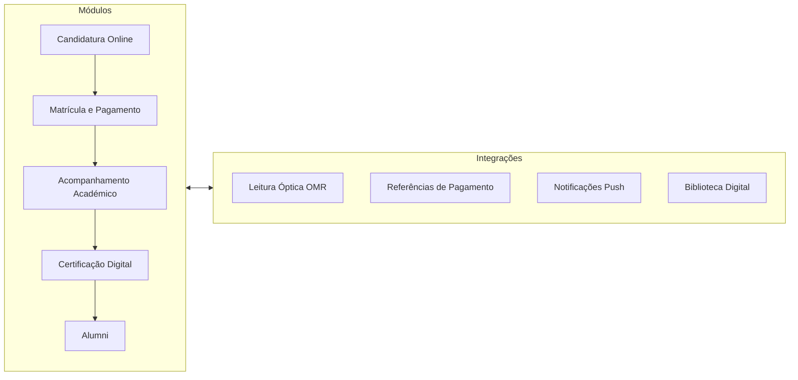
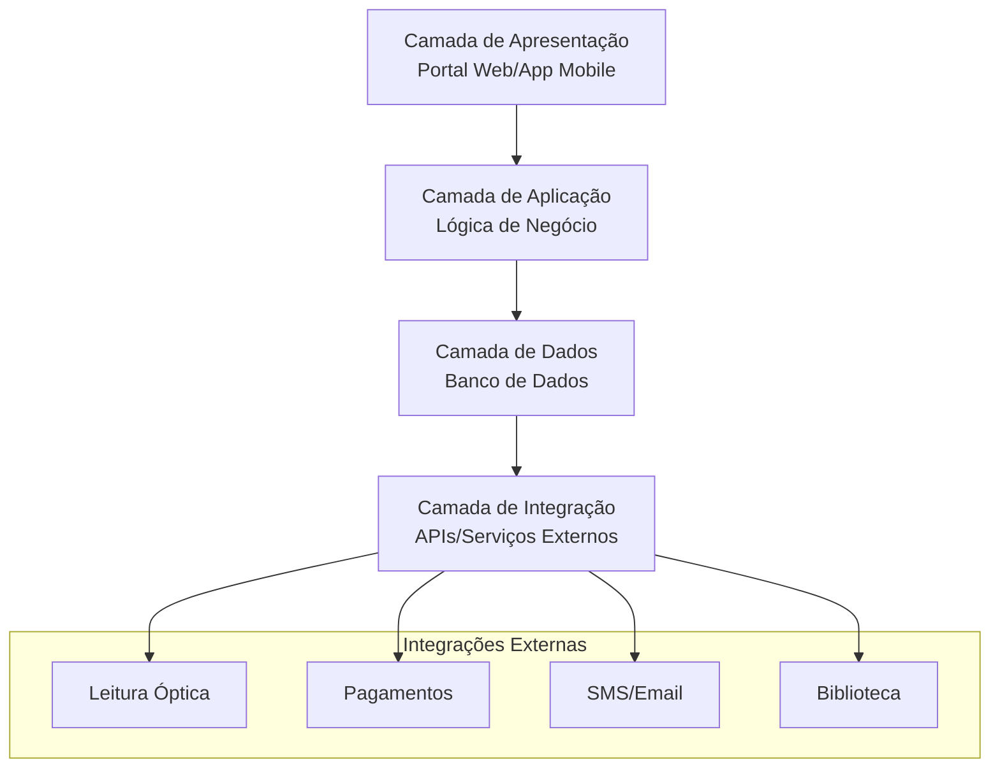

Abaixo está o arquivo Markdown pronto — basta copiar e salvar como `sistemas-academicos.md`:

````markdown
# 🎓 Sistemas Acadêmicos Escolares Complexos — Dossiê Completo

> **Escopo:** Sistemas de Gestão Acadêmica (SIS/ERP escolar), portais de estudantes,
> controle de acesso físico (portões/catracas), apps institucionais, arquitetura,
> padrões de interoperabilidade, segurança e tendências.
> **Nota:** Documento compilado a partir de conhecimento sobre plataformas reais do
> mercado. Fontes oficiais para aprofundamento estão na seção 14.

---

## 1. Panorama Geral

Sistemas acadêmicos complexos são plataformas integradas que administram todo o ciclo
de vida de uma instituição de ensino: **do marketing e vestibular até a diplomação**,
passando por matrícula, notas, frequência, financeiro, biblioteca, transporte, refeitório
e controle de acesso físico ao campus.

O ecossistema se divide em camadas que se integram:

```
┌─────────────────────────────────────────────────────────────┐
│                 CAMADA DE ENGAJAMENTO                       │
│   Apps mobile · Portais do Aluno · Chatbots · Comunicação   │
├─────────────────────────────────────────────────────────────┤
│                 CAMADA DE ENSINO (LMS)                      │
│   Aulas · AVA · Atividades · Notas · Sala virtual           │
├─────────────────────────────────────────────────────────────┤
│                 NÚCLEO ADMINISTRATIVO (SIS/ERP)             │
│   Matrícula · Currículo · Histórico · Financeiro · RH       │
├─────────────────────────────────────────────────────────────┤
│                 CAMADA FÍSICA / OPERACIONAL                 │
│   Catracas · Biometria · Biblioteca · RU · Dormitórios      │
└─────────────────────────────────────────────────────────────┘
```

---

## 2. Taxonomia dos Sistemas

| Tipo | Sigla | Função | Exemplos |
|---|---|---|---|
| Student Information System | SIS | Registro acadêmico central (o "cérebro") | PowerSchool, Banner, Q-Acadêmico |
| ERP Acadêmico | — | SIS + financeiro + RH + estoque + logística | TOTVS RM, SAP SLCM |
| Learning Management System | LMS / AVA | Entrega de ensino, aulas, atividades | Canvas, Moodle, Blackboard |
| CRM Acadêmico | CRM | Captação de alunos, funil de admissions | Slate, HubSpot Ed., Element451 |
| Campus Card / Transact | — | Carteira estudantil multifuncional (créditos, acesso, pagamento) | Transact, CBORD |
| Physical Access Control System | PACS | Catracas, portas, portões | Gallagher, HID, Control iD |
| Learning Analytics | LA | Indicadores, risco de evasão, dashboards | EAB Navigate, Civitas |

---

## 3. SIS — Sistema de Informação Studantil (o núcleo)

### 3.1 Módulos típicos de um SIS/ERP escolar completo

**Registros acadêmicos**
- Cadastro de alunos, responsáveis, professores (com vínculos e documentos)
- Estruturas curriculares (matriz, pré-requisitos, equivalências, co-requisitos)
- Catálogo de cursos, séries, turnos e turmas
- Matrícula/rematrícula online (com regras de crédito, filas e conflito de horário)
- Grade horária e alocação de salas (às vezes com algoritmo de otimização)
- Diário de classe, lançamento de notas, conceitos, recuperação, dependência
- Frequência (manual, QR Code, chamada digital, integração com catraca)
- Histórico escolar, boletins, atestados de matrícula, transferências
- Conselhos de classe e pareceres descritivos (comum no Brasil)

**Financeiro**
- Mensalidades, boletos, PIX, carnês, negociação de débitos
- Bolsas, descontos, convênios, FIES/Prouni (Brasil)
- Contratos com assinatura eletrônica
- Fluxo de caixa, contas a pagar/receber, contabilidade escolar

**Operação**
- Biblioteca (empréstimo, multa, acervo, integração ISBN)
- Refeitório/RU (créditos no cartão estudantil, filas, diets)
- Transporte escolar (rotas, rastreio, embarque)
- Merenda e estoque
- Comunicação: comunicados, SMS, push, e-mail, agenda
- Gestão de professores: RH, folha, substituições, HTPC

### 3.2 Principais plataformas no mundo

| Plataforma | Origem | Segmento | Destaques |
|---|---|---|---|
| **PowerSchool SIS** | EUA | K-12 | Líder de mercado norte-americano, dezenas de milhões de alunos |
| **Infinite Campus** | EUA | K-12 | Muito usado por distritos escolares públicos |
| **Skyward** | EUA | K-12 | SIS + gestão financeira de distritos |
| **Blackbaud K-12** | EUA | Escolas privadas | Suíte onBoard/onRecord/onCampus/onMessage |
| **Veracross** | EUA | Escolas independentes | SIS com CRM integrado |
| **SIMS (Capita)** | Reino Unido | K-12 | Histórico dominante no Reino Unido |
| **Arbor / Bromcom** | Reino Unido | K-12 | Concorrentes em nuvem do SIMS |
| **Ellucian Banner** | EUA | Superior | Um dos SIS universitários mais usados do mundo |
| **Ellucian Colleague / Ethos** | EUA | Superior | Suíte + plataforma de integração Ethos |
| **Oracle PeopleSoft CS** | EUA | Superior | Campus Solutions, comum em grandes públicas |
| **Workday Student** | EUA | Superior | Geração cloud, UX moderna, planejamento curricular |
| **SAP SLCM** | Alemanha | Superior | Student Lifecycle Management sobre S/4HANA |
| **Anthology** | EUA | Superior | Fusão Blackboard + Campus Management + Campus Labs |
| **Tribal SITS** | Reino Unido | Superior | Dominante em universidades britânicas |
| **Jenzabar / Unit4** | EUA | Superior | Nichos de pequenas/médias IES |

### 3.3 Plataformas brasileiras

| Sistema | Segmento | Observações |
|---|---|---|
| **TOTVS Educação (linha RM)** | K-12 + Superior | ERP dominante em escolas privadas de grande porte |
| **Q-Acadêmico (Qualidata)** | Superior | Usado por centenas de IES privadas brasileiras |
| **Lyceum** | Superior | Forte em Institutos Federais e grupos de ensino |
| **SIGA** (diversos) | Superior | Sistemas próprios: UFRJ, FAETEC, etc. |
| **Sistemas próprios de federais** | Superior | Júpiter (USP), portal DAC (UNICAMP), etc. |
| **SIEPE** | Pernambuco | Gestão educacional da rede estadual |
| **Sistemas de secretaria estadual** | K-12 público | Diário de classe digital, censso, folha |

**Sistemas federais do ecossistema brasileiro:** SISU (seleção unificada via ENEM),
Prouni, FIES, **Educacenso** (censo escolar), **e-MEC** (regulação de IES) — todos
precisam ser integrados ou alimentados pelos sistemas locais.

---

## 4. LMS — Camada de Ensino

| LMS | Modelo | Observações |
|---|---|---|
| **Moodle** | Open source | Mais usado no mundo; forte em universidades públicas BR |
| **Canvas LMS (Instructure)** | Cloud | Adotado por Harvard, Stanford, MIT e a maioria das grandes dos EUA |
| **Blackboard Learn** | Cloud | Veterano; hoje Anthology |
| **Brightspace (D2L)** | Cloud | Forte em corporativo e Canadá |
| **Google Classroom** | Freemium | Dominante em K-12 básico |
| **Sakai** | Open source | Comunidade de universidades |
| **Open edX** | Open source | Base de MOOCs (edX) |

A integração SIS ↔ LMS é feita geralmente via padrão **LTI (Learning Tools
Interoperability)** e sincronização de turmas via **OneRoster** (ver seção 10).

---

## 5. Portais do Aluno — Anatomia Funcional

Um portal estudantil maduro típico (ex.: Portal do Aluno do Q-Acadêmico, my.Harvard,
Axess de Stanford) oferece:

1. **Matrícula online** — grade de disciplinas com drag-and-drop, fila de espera,
   checagem automática de pré-requisitos, limites de crédito, conflito de horário
2. **Financeiro** — 2ª via de boleto, PIX, extrato, negociação, contratos
3. **Acadêmico** — histórico, boletim, grade horária, calendário, requerimentos
4. **Documentos digitais** — atestados, declarações e diplomas com QR Code de validação
5. **Comunicação** — avisos, mural, e-mail institucional, mensagens de professores
6. **Autosserviço** — troca de turma, trancamento, atualização cadastral

**Regra de ouro arquitetural:** o portal **nunca escreve direto no banco** do SIS —
consome APIs e mantém filas de processamento (a matrícula de milhares de alunos ao
mesmo tempo exige filas, rate limiting e transações atômicas).

---

## 6. Controle de Acesso Físico — "Portões de Estudantes"

### 6.1 Arquitetura típica

```
[SIS/ERP] ──API/Webhook──> [Servidor de Acesso]
                              │
        ┌─────────────────────┼─────────────────────┐
        ▼                     ▼                     ▼
   [Catracas/Torniquetes] [Portas de sala]    [Cancelas/pedágio]
   Biometria + cartão     Leitor de porta     OCR de placa + lista
        │                     │
        └──── Wiegand / OSDP / IP ────> [Controladoras]
                                          │
                                          ▼
                              [Logs + Eventos + Alertas]
                              (entrada, saída, intrusão,
                               antipassback, aluno bloqueado
                               por inadimplência)
```

**Conceitos-chave de PACS:**
- **Controladora** — o "cérebro" local que decide liberar ou não (funciona offline)
- **Antipassback** — impede usar a mesma credencial para entrar duas vezes
- **Duas zonas** — entrada/saída separadas (catracas bidirecionais)
- **Integração com SIS** — aluno paga mensalidade → credencial reativada
  automaticamente; aluno jubilado → credencial revogada
- **Eventos** — toda passagem gera log usado para frequência automática
  (comum no Brasil integrar catraca ao diário de classe)

### 6.2 Tecnologias de credencial

| Tecnologia | Como funciona | Prós | Contras |
|---|---|---|---|
| Cartão RFID (MIFARE, iCLASS) | Cartão com chip sem contato | Barato, rápido | Compartilhável, clonável (MIFARE Classic) |
| QR Code dinâmico | QR gerado no app com expiração | Sem custo de cartão | Fila de leitura, tela quebrada |
| Biometria digital | Leitor óptico/capacitivo + template | Não transfere | Higienização, glicemia/idade prejudicam leitura |
| Reconhecimento facial | Câmera + IA, liveness detection | "Hands-free", rápido | LGPD, iluminação, spoofing |
| NFC/credencial móvel | Celular emula o cartão | Sem cartão físico | Precisa de smartphone |
| BLE | Bluetooth de longo alcance | Portais automáticos sem tirar o celular | Custo |

**Protocolos de leitor:** Wiegand (legado, sem criptografia) → **OSDP**
(Open Supervised Device Protocol — padrão atual, criptografado, bidirecional).

### 6.3 Fabricantes relevantes

- **Brasil (catracas escolares):** Control iD, Henry, Digicon, Rozini
- **Global (PACS corporativo/universitário):** HID Global, Lenel OnGuard,
  Genetec Synergis, Gallagher Command Centre, Brivo, Openpath/Motorola
- **Torniquetes de alta vazão:** Boon Edam, Gunnebo, Magnetic Autocontrol
- **Facial/biometria em massa:** ZKTeco, Hikvision, Dahua, Vision-Box
- **Campus card (crédito + acesso + refeitório):** Transact Campus, CBORD

### 6.4 Caso clássico: o "Campus Card" universitário

Em universidades americanas, um único cartão/app faz: acesso a dormitório,
biblioteca, academia e laboratório + pagamento no refeitório, impressão,
lavanderia e eventos. Sistemas como **Transact** e **CBORD** centralizam a
"conta estudantil" com cartão de crédito pré-pago embutido. A tendência é mover
tudo para o **wallet do celular** (Apple/Google Wallet com credenciais NFC).

---

## 7. Apps Acadêmicos Institucionais

Apps oficiais de grandes instituições (ex.: **MIT Mobile**, **Stanford Mobile**,
**USP App**, apps de Institutos Federais) costumam combinar:

- Carteirinha estudantil digital (com QR/foto válida offline)
- Catraca/liberação de acesso (NFC ou QR dinâmico)
- Saldo e cardápio do restaurante universitário (RU)
- Catálogo e renovação da biblioteca
- Horários e rastreio de circular/ônibus do campus
- Mapa interno dos prédios
- Notificações push de emergência e avisos
- Acesso ao portal do aluno (SSO)

**Diferença crucial:** apps de *instituição* (engajamento) vs apps de *LMS*
(Canvas Student, Moodle App) vs apps de *produto de estudo* (Khan Academy,
Photomath) — muitos estudantes usam os três ecossistemas simultaneamente.

---

## 8. Casos de Grandes Instituições

| Instituição | Sistema | Detalhes |
|---|---|---|
| **USP** | Júpiter (graduação), Apolo (pós) | Sistemas próprios; matrícula online por créditos; carteirinha USP digital |
| **UNICAMP** | Portal da DAC | Sistema próprio da Diretoria Acadêmica, matrícula centralizada |
| **UFRJ** | SIGA / AlunoWeb | Sistema Integrado de Gestão Acadêmica |
| **MIT** | Atlas + Canvas + Blockcerts | Pioneiro em diplomas verificáveis via blockchain (2017, com Blockcerts) |
| **Stanford** | Axess + Canvas | Portal administrativo + LMS |
| **Harvard** | my.Harvard + Canvas | Portal estudantil unificado |
| **UC Berkeley** | CalCentral | Agregador acadêmico + financeiro |
| **Institutos Federais (BR)** | Lyceum / sistemas próprios | Matrícula, diário, biblioteca integrados |

---

## 9. Arquitetura Técnica (como são construídos)

### 9.1 Padrões arquiteturais

- **Legado (ainda muito comum):** monólito + banco relacional (Oracle/SQL Server) +
  jobs batch noturnos + telas desktop (Delphi/Java Swing, no Brasil)
- **Modernização:** API-first, microserviços por domínio (matrícula, notas,
  financeiro), event streaming (Kafka) para eventos como "matrícula concluída"
- **Deploy:** híbrido — grandes públicas mantêm on-premise; mercado novo é SaaS
  multi-tenant (uma instância, milhares de escolas)

### 9.2 Stack típica moderna

- **Backend:** Java/Spring, .NET, Node, Python · APIs REST/GraphQL
- **Frontend:** React/Angular/Vue · PWA para alcance sem loja de apps
- **Mobile:** Flutter/React Native (um codebase, Android+iOS)
- **Banco:** PostgreSQL/Oracle/SQL Server + Redis (cache de matrícula) +
  Elasticsearch (busca de cursos) + data warehouse para BI
- **Integração:** barramento/iPaaS, webhooks para catracas e pagamentos
- **Identidade:** SSO com **SAML 2.0 / OpenID Connect**, MFA obrigatório,
  sincronização com LDAP/Active Directory/Entra ID

### 9.3 Desafios clássicos de engenharia

1. **Pico de matrícula** — milhares de alunos competindo por vagas em segundos:
   filas de mensageria, locks otimistas, sessões em Redis, rate limit por aluno
2. **Consistência do histórico** — notas nunca podem se perder: transações ACID,
   trilha de auditoria imutável de qualquer alteração de nota
3. **Sincronização com catracas** — controladoras ficam offline: credenciais
   replicadas localmente + ressincronização de eventos quando a rede volta
4. **Fuso, calendário e exceções** — a "simples" regra de frequência esconde
   anos letivos, feriados municipais, suspensões, blended learning

---

## 10. Interoperabilidade e Padrões Internacionais

| Padrão | Mantenedor | Para quê |
|---|---|---|
| **LTI 1.3 / Advantage** | 1EdTech (ex-IMS Global) | Plug de ferramentas externas dentro do LMS com login único e notas |
| **OneRoster** | 1EdTech | Troca padronizada de listas de alunos/turmas entre SIS ↔ LMS ↔ apps |
| **Caliper Analytics** | 1EdTech | Eventos de aprendizagem padronizados para analytics |
| **QTI** | 1EdTech | Questões e provas portáveis entre plataformas |
| **Open Badges 3.0** | 1EdTech | Microcredenciais verificáveis |
| **Ed-Fi** | Ed-Fi Alliance | Padrão de dados para K-12 (distritos nos EUA) |
| **SIF** | A4L Community | Mensageria entre sistemas escolares |
| **OSDP** | SIA | Protocolo criptografado leitor ↔ controladora de acesso |
| **Wiegand** | Legado | Protocolo clássico de leitores de cartão |
| **PESC / SPEEDE** | PESC | Transcrições eletrônicas de ensino superior |

**No Brasil:** não há padrão dominante — cada SIS expõe APIs próprias; integrações
com gov (Educacenso, SISU, e-MEC) são obrigatórias e feitas por arquivo/API.

---

## 11. Segurança, Privacidade e Compliance

| Norma | Região | Impacto no sistema |
|---|---|---|
| **FERPA** | EUA | Direitos de pais/alunos sobre registros educacionais |
| **LGPD** | Brasil | Dados de menores (art. 14), consentimento, DPO, bases legais, ANPD |
| **GDPR** | Europa | Minimização, direito ao esquecimento, DPIA |
| **COPPA** | EUA | Dados de crianças < 13 anos |

**Boas práticas de produto:**
- Dado sensível de menor: acesso segmentado por papel (professor vê só a turma dele;
  responsável vê só o filho — multi-tenancy por vínculo)
- Biometria = dado sensível na LGPD: consentimento explícito + alternativa não biométrica
- Trilha de auditoria completa (quem alterou qual nota, quando)
- Criptografia em trânsito (TLS) e em repouso; senhas com Argon2/bcrypt; MFA
- Retenção e descarte de dados por política documentada
- Validação de documentos via assinatura digital + QR Code (evita "atestado falso")

---

## 12. IA, Analytics e Tendências (2024–2025)

1. **Alerta precoce de evasão** — plataformas como **EAB Navigate**, **Starfish**
   e **Civitas Learning** cruzam frequência, notas, login no LMS e financeiro para
   prever risco de abandono e disparar intervenções de orientação acadêmica
2. **Chatbots de atendimento estudantil** — resolvem dúvidas de matrícula,
   documentos e calendário 24/7 (ex.: Ocelot, AdmitHub)
3. **Credenciais verificáveis / blockchain** — diplomas e microcertificados
   assinados criptograficamente (Blockcerts, pilotos do MEC no Brasil)
4. **Wallet universitária** — carteirinha, chave de acesso e carteira de
   pagamento no Apple/Google Wallet
5. **IA generativa no LMS** — correção assistida, tutores, geração de material;
   decisão crítica sobre detector de IA em trabalhos
6. **Consolidação do mercado** — Anthology, PowerSchool e Ellucian acquiring
   nichos; pressão por interoperabilidade (LTI/OneRoster) como critério de compra

---

## 13. Se Você Fosse Construir Um — Checklist de Requisitos

**MVP (fase 1):**
- [ ] Cadastro de alunos/responsáveis/professores com papéis
- [ ] Matrícula e turmas
- [ ] Diário de classe, notas, frequência, boletim em PDF
- [ ] Comunicados e portal responsável

**Fase 2:**
- [ ] Financeiro (boletos/PIX, inadimplência, negociação)
- [ ] Matrícula online com conflito de horário e pré-requisitos
- [ ] App mobile com push e carteirinha digital
- [ ] Integração LMS (LTI) e emissão de documentos assinados

**Fase 3 (complexo):**
- [ ] Controle de acesso: catracas, biometria facial, revogação automática
- [ ] Biblioteca, RU, transporte com rastreio
- [ ] Analytics de evasão e dashboards
- [ ] Integrações governamentais e blockchain de diplomas

---

## 14. Fontes Oficiais para Aprofundamento

- **1EdTech** (padrões LTI, OneRoster): 1edtech.org
- **Ed-Fi Alliance**: ed-fi.org
- **Ellucian**: ellucian.com · **Instructure (Canvas)**: instructure.com
- **PowerSchool**: powerschool.com · **Anthology**: anthology.com
- **Transact Campus**: transactcampus.com · **CBORD**: cbord.com
- **OSDP/SIA (acesso físico)**: securityindustry.org
- **LGPD**: planalto.gov.br (Lei 13.709/2018) · **FERPA**: studentprivacy.ed.gov
- **USP Júpiter**: usp.br/jupitar · **MIT Blockcerts**: media.mit.edu
- **Canvas (casos Harvard/Stanford/MIT)**: docs institucionais de cada universidade

---

*

# 📊 Análise dos Portais Acadêmicos Institucionais em Angola

>
## 🎯 Resumo Executivo

Os sistemas acadêmicos em Angola apresentam um cenário em evolução, com **soluções nacionais** ganhando espaço sobre sistemas estrangeiros devido a fatores econômicos e de adaptação local. A análise revela plataformas em diferentes estágios de maturidade, desde sistemas integrados completos como o **SIGA** 【turn0search9】 até portais mais focados como o da **Universidade Metodista de Angola** 【turn0search1】.

---

## 📋 Principais Portais Acadêmicos Identificados

| Instituição/Sistema | Nome do Portal | Funcionalidades Principais | Arquitetura/Modelo |
|-------------------|---------------|----------------------------|-------------------|
| **Universidade Metodista de Angola** | Portal do Estudante 【turn0search1】 | Consulta de notas, pautas, horários e atividades académicas | Sistema centralizado |
| **Escola Superior Técnica de Saúde do Huambo (ESTSH)** | Portal do Estudante 【turn0search2】【turn0search4】 | Acesso com credenciais, informações académicas | Sistema baseado em web |
| **Instituto Nacional de Gestão de Bolsas (INAGBE)** | Portal do Estudante 【turn0search3】 | Perfil, acompanhamento de candidaturas e bolsas de estudo | Sistema governamental |
| **Universidade Técnica de Angola (UTANGA)** | Sistema Interno 【turn0search6】 | Consulta de notas, calendários, pagamentos, exames | Sistema desenvolvido internamente |
| **Sistema Integrado de Gestão Académica (SIGA)** | SIGA 【turn0search9】 | 10 módulos integrados da candidatura à formatura | Sistema modular completo |

---

## 🔍 Análise Arquitetural Detalhada

### 1. **SIGA - Sistema Integrado de Gestão Académica** 【turn0search9】


**Arquitetura Modular:**
- **Exame de Acesso**: Correcção automática por leitura óptica (OMR)
- **Serviços Académicos**: Matrícula, turmas, pautas e certificados digitais
- **Área Financeira**: Referências de pagamento automáticas e conciliação bancária
- **Portal do Encarregado**: Acompanhamento em tempo real com alertas
- **Biblioteca**: Catalogação, empréstimos e repositório digital
- **Comunicação**: SMS e e-mail em massa
- **Aplicação Móvel**: Notas, horários e financeiro no telemóvel

**Tecnologias Identificadas:**
- Sistema web-based responsivo
- Integração com leitura óptica (OMR)
- Conciliação bancária automática
- Notificações push para dispositivos móveis
- Sistema modular com APIs para integração

### 2. **Portal do Estudante - Universidade Metodista de Angola** 【turn0search1】
**Características Arquiteturais:**
- Plataforma centralizada para serviços académicos
- Foco na consulta de informações (notas, pautas, horários)
- Sistema de credenciais para acesso
- Arquitetura provavelmente baseada em sistemas tradicionais de gestão académica

### 3. **Sistema Interno UTANGA** 【turn0search6】
**Modelo de Desenvolvimento:**
- Sistema desenvolvido por engenheiros internos da universidade
- Foco em autonomia e adaptação às necessidades específicas
- Controle de acesso por papéis (professores, alunos)
- Períodos específicos para lançamento de notas
- Restrições baseadas em situação financeira

### 4. **Portal INAGBE** 【turn0search3】
**Arquitetura Governamental:**
- Sistema integrado com gestão de bolsas de estudo
- Foco em processos de candidatura e acompanhamento
- Integração com sistemas governamentais de Angola
- Provável arquitetura SOA (Service-Oriented Architecture)

---

## 🏗️ Padrões Arquiteturais Comuns

### **1. Arquitetura em Camadas**


### **2. Tecnologias Identificadas**
- **Backend**: Sistemas web tradicionais com possibilidade de APIs REST
- **Frontend**: Interfaces web responsivas
- **Banco de Dados**: Sistemas relacionais para dados académicos
- **Integração**: Leitura óptica (OMR), sistemas de pagamento, SMS/email

### **3. Segurança e Controle de Acesso**
- **Autenticação**: Credenciais de usuário (usuário/senha)
- **Autorização**: Controle baseado em papéis (aluno, professor, administrador)
- **Restrições Financeiras**: Bloqueio de acesso a notas/serviços para inadimplentes 【turn0search6】
- **Períodos de Acesso**: Controle temporal para ações específicas (ex: lançamento de notas) 【turn0search6】

---

## 📈 Tendências e Desafios

### **1. Movimento para Sistemas Nacionais**
> ⚠️ **Fator Econômico**: O elevado custo de sistemas estrangeiros, agravado por flutuações cambiais, tem impulsionado universidades angolanas a desenvolver soluções internas 【turn0search6】.

### **2. Desafios Identificados**
- **Vulnerabilidades de Segurança**: Sistemas frágeis podem potenciar ciberataques ou fraudes 【turn0search6】
- **Dependência de Infraestrutura**: Necessidade de conectividade estável
- **Manutenção Contínua**: Sistemas internos exigem desenvolvimento constante

### **3. Integração com Moodle**
Pesquisas indicam esforços para integrar sistemas de gestão académica com plataformas de aprendizagem como Moodle 【turn0search7】, criando um ecossistema educacional completo.

---

## 🏆 Melhores Práticas Observadas

<details>
<summary>📋 **Checklist de Implementação Baseado nos Casos Angola**</summary>

### ✅ **Funcionalidades Essenciais**
- [ ] Portal do estudante com acesso credenciado
- [ ] Consulta de notas e pautas
- [ ] Sistema de matrícula online
- [ ] Gestão financeira (propinas, pagamentos)
- [ ] Emissão de certificados e declarações digitais
- [ ] Sistema de comunicação (SMS/email)
- [ ] Aplicação móvel integrada

### ✅ **Considerações Arquiteturais**
- [ ] Sistema modular para fácil manutenção
- [ ] APIs para integração com sistemas externos
- [ ] Controle de acesso baseado em papéis
- [ ] Conciliação automática de pagamentos
- [ ] Sistema de notificações em tempo real
- [ ] Backup e segurança de dados

### ✅ **Aspectos Específicos Angola**
- [ ] Integração com sistemas governamentais (MESCTI, INAGBE)
- [ ] Suporte a múltiplas unidades orgânicas
- [ ] Adaptação a realidades locais (moeda, idioma)
- [ ] Consideração de infraestrutura tecnológica local
</details>

---

## 🔄 Comparação com Padrões Internacionais

| Aspecto | Angola | Padrão Internacional |
|---------|--------|---------------------|
| **Integração** | Sistemas modulares em desenvolvimento | LTI (Learning Tools Interoperability) |
| **Padrões** | Desenvolvimento interno | OneRoster, Caliper Analytics |
| **Segurança** | Controle de acesso básico | FERPA, GDPR, criptografia avançada |
| **Mobilidade** | Apps móveis básicos | Progressive Web Apps, wallets digitais |
| **Analytics** | Relatórios básicos | Learning Analytics avançado |

---

## 💻 Recomendações para Implementação

### **1. Para Desenvolvedores**
```python
# Exemplo de arquitetura modular para sistema académico angolano
class SistemaAcademicoAngola:
    def __init__(self):
        self.modulos = {
            'candidatura': ModuloCandidatura(),
            'academico': ModuloAcademico(),
            'financeiro': ModuloFinanceiro(),
            'biblioteca': ModuloBiblioteca(),
            'comunicacao': ModuloComunicacao()
        }
    
    def integrar_sistema(self, sistema_externo):
        # Padrão de integração com sistemas governamentais
        pass
```

### **2. Para Instituições**
1. **Avaliar Necessidades**: Considerar tamanho, recursos e necessidades específicas
2. **Opção Híbrida**: Combinar sistemas nacionais com soluções internacionais
3. **Investir em Treinamento**: Capacitar equipes técnicas para manutenção
4. **Foco na Segurança**: Implementar protocolos de segurança robustos
5. **Planejar Escalabilidade**: Considerar crescimento futuro

---

## 📊 Análise de Custo-Benefício

| Fator | Sistema Estrangeiro | Sistema Nacional |
|-------|--------------------|-----------------|
| **Custo Inicial** | Alto (licenciamento) | Médio (desenvolvimento) |
| **Manutenção** | Alta (dependência externa) | Média (controle interno) |
| **Adaptação** | Limitada às necessidades locais | Totalmente customizável |
| **Segurança** | Atualizações frequentes | Depende da equipe interna |
| **Suporte** | Dependente do fornecedor | Resposta local rápida |

---

## 🚀 Futuro dos Sistemas Acadêmicos em Angola

### **Tendências Emergentes**
1. **Maior Integração**: Conexão com sistemas governamentais (MESCTI, INAGBE)
2. **Mobilidade Aprimorada**: Apps mais sofisticados com wallets digitais
3. **Analytics Educacional**: Uso de dados para melhorar aprendizagem
4. **Interoperabilidade**: Padrões como LTI para integração com LMS

### **Recomendações Estratégicas**
1. **Investir em P&D**: Desenvolvimento contínuo de soluções locais
2. **Parcerias Público-Privadas**: Colaboração entre universidades e empresas
3. **Padronização**: Adoção de padrões internacionais para interoperabilidade
4. **Foco na Experiência**: Interfaces mais intuitivas para estudantes e professores

---

## 📝 Conclusão

Os portais académicos em Angola apresentam um **cenário de transição**, com sistemas nacionais ganhando espaço por razões econômicas e de adaptação. O **SIGA** 【turn0search9】 representa o estado da arte em integração, enquanto instituições como a **UTANGA** 【turn0search6】 demonstram a viabilidade de desenvolvimento interno.

A arquitetura predominante é **modular e web-based**, com integrações especializadas para necessidades locais (leitura óptica, pagamentos, comunicação). O futuro aponta para maior **interoperabilidade** e **analytics** educacional, com Angola desenvolvendo soluções tecnológicas próprias adaptadas à sua realidade específica.

---

## 📚 Referências e Fontes

1. **SIGA - Sistema Integrado de Gestão Académica** 【turn0search9】
2. **Universidade Metodista de Angola - Portal do Estudante** 【turn0search1】
3. **Escola Superior Técnica de Saúde do Huambo** 【turn0search2】【turn0search4】
4. **Instituto Nacional de Gestão de Bolsas (INAGBE)** 【turn0search3】
5. **Universidade Técnica de Angola (UTANGA)** 【turn0search6】
6. **Ministério do Ensino Superior, Ciência, Tecnologia e Inovação (MESCTI)** 【turn0search15】【turn0search19】
7. **Expansão - Universidades preferem sistemas de gestão académica "nacionais"** 【turn0search6】

---

> 